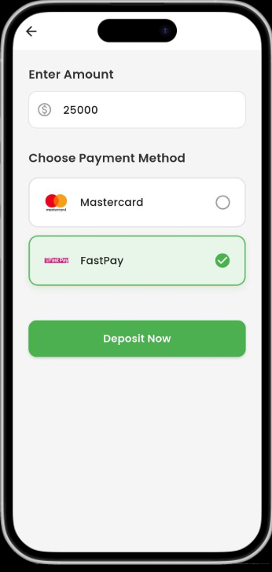
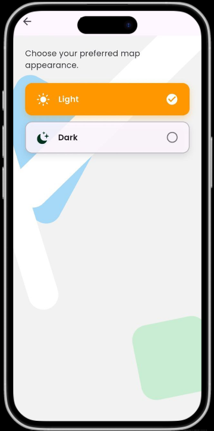
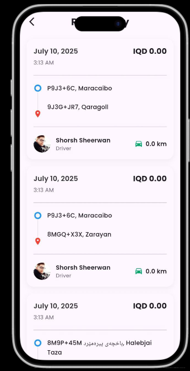
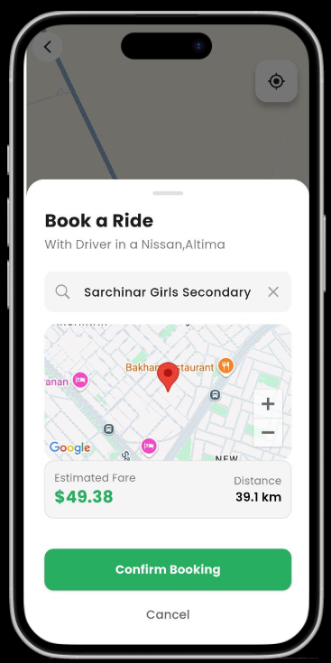
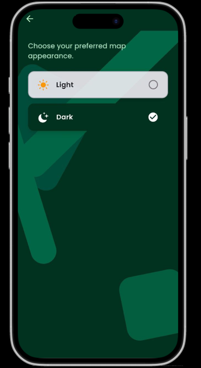

# Taxi Booking App Flutter

A full-featured **Flutter Taxi Booking App** built with Firebase, Google Maps, and many modern Flutter packages to provide a smooth, efficient, and engaging ride-hailing experience for both passengers and drivers.

---

## Features

- Real-time ride booking with Google Maps integration  
- Firebase Authentication & Firestore for user management and ride data  
- Dynamic ride requests and driver matching  
- Animated splash screens and smooth UI animations  
- In-app payment and wallet system support  
- OTP verification and secure user login  
- Driver and passenger profiles with rating system  
- Confetti and fortune wheel rewards for user engagement  
- Location tracking with geolocator and geocoding  
- Custom license plate widget and vehicle details  
- Push notifications and alerts  

---

## Screenshots

Here are some screenshots from the app UI:

## Screenshots

<table>
  <tr>
    <td></td>
    <td></td>
    <td></td>
  </tr>
  <tr>
    <td></td>
    <td></td>
    <td></td>
        <td></td>

  </tr>

</table>

---

## Getting Started

### Prerequisites

- Flutter SDK (version 3.6.0 or higher)  
- Firebase project configured for your app  
- Google Maps API key  

### Installation

1. Clone the repository:

   ```bash
   git clone https://github.com/shram0077/taxi-booking-app-flutter.git
   cd taxi-booking-app-flutter
Install dependencies:

bash
Copy
Edit
flutter pub get
Add your Firebase config files:

google-services.json (Android) inside android/app/

GoogleService-Info.plist (iOS) inside ios/Runner/

Run the app:

bash
Copy
Edit
flutter run
Packages Used
Firebase
firebase_core, firebase_auth, cloud_firestore
For backend services, authentication, and realtime database.

Google Maps & Location
google_maps_flutter, geolocator, geocoding
For maps display, real-time location tracking, and reverse geocoding.

UI & Animations
google_fonts, flutter_svg, lottie, animated_splash_screen, flutter_animate, shimmer, animate_do, flutter_staggered_animations
For rich UI, vector graphics, splash screens, and animations.

User Interaction & Input
pin_code_fields, flutter_typeahead, flutter_rating_bar
For secure inputs, autocomplete, and rating widgets.

State Management & Utilities
provider, get, shared_preferences, intl, restart_app
For state management, preferences, localization, and app restart.

Network & HTTP
dio, http, url_launcher, permission_handler
For network requests, URL launching, and permission handling.

Media & Images
image_picker, image_cropper, cached_network_image
For handling images and caching.

Fun & Engagement
confetti, flutter_fortune_wheel, audioplayers, alert_info
For user rewards, sound effects, and alerts.

Security
encrypt
For encryption utilities to secure sensitive data.

Folder Structure
bash
Copy
Edit
/lib
  /Screens       - UI screens  
  /Services      - API and Firebase services  
  /Widgets       - Reusable widgets  
  /Models        - Data models  

/assets
  /animations    - Lottie animation files  
  /images        - Icons and images  
  /sounds        - Audio files  

/mapstyle        - Custom Google Map styles
Contribution
Feel free to fork this repository, improve the code, and send pull requests!
Open issues for bugs or feature requests are welcome.

License
This project is private and not published to pub.dev.
Please contact the author for any inquiries.

Contact
Shram0077 – GitHub Profile
Email: shram0077@gmail.com

Thank you for checking out this project! 🚖✨

yaml
Copy
Edit

---

If you want, I can generate this as a ready-to-upload `README.md` file for you!
