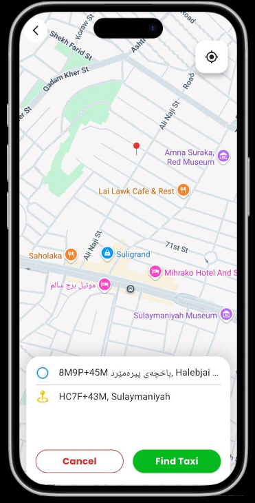
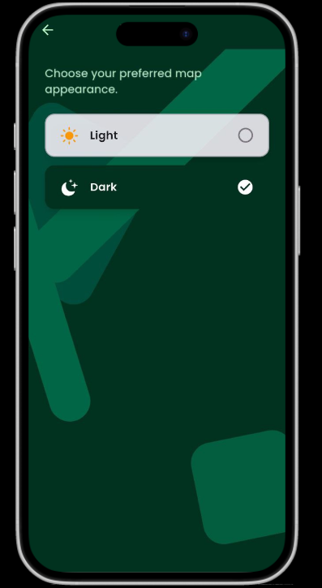
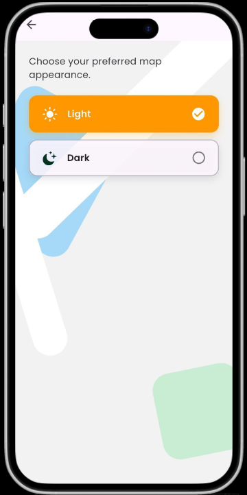

# 🚖 Taxi Booking App Flutter

A full-featured **Flutter Taxi Booking App** built with Firebase, Google Maps, and many modern Flutter packages to provide a smooth, efficient, and engaging ride-hailing experience for both passengers and drivers.

---

## ✨ Features

✅ Real-time ride booking with Google Maps integration  
🔠Firebase Authentication & Firestore for user management and ride data  
🚗 Dynamic ride requests and driver matching  
🬠Animated splash screens and smooth UI transitions  
💳 In-app payment and wallet system support  
📲 OTP verification and secure login  
👤 Driver and passenger profiles with rating system  
🉠Confetti and fortune wheel for daily rewards  
📠Location tracking using geolocator and geocoding  
🪪 Custom license plate widget and car information  
🔔 Push notifications and alerts  

---

## ğŸ–¼ï¸ Screenshots

<table>
  <tr>
    <td></td>
    <td></td>
    <td></td>
  </tr>
  <tr>
    <td></td>
    <td></td>
    <td></td>
  </tr>
  <tr>
    <td></td>
  </tr>
</table>

---

## 🚀 Getting Started

### 🔧 Prerequisites

- ✅ Flutter SDK (version 3.6.0 or higher)  
- 🔥 Firebase project configured  
- ğŸ—ºï¸ Google Maps API key

### 🛠 Installation

```bash
# Clone the repo
git clone https://github.com/shram0077/taxi-booking-app-flutter.git
cd taxi-booking-app-flutter

# Install dependencies
flutter pub get
🔑 Firebase Configuration
Add google-services.json to android/app/

Add GoogleService-Info.plist to ios/Runner/

â–¶ï¸ Run the App
bash
Copy
Edit
flutter run
📦 Packages Used
🔥 Firebase
firebase_core, firebase_auth, cloud_firestore
→ Authentication, backend, and realtime database

🗺 Maps & Location
google_maps_flutter, geolocator, geocoding
→ Live map, tracking, and address conversion

🨠UI & Animations
google_fonts, flutter_svg, lottie, animated_splash_screen, flutter_animate, shimmer, animate_do, flutter_staggered_animations

📲 User Input
pin_code_fields, flutter_typeahead, flutter_rating_bar

âš™ï¸ State & Utilities
provider, get, shared_preferences, intl, restart_app

🌠Networking & Permissions
dio, http, url_launcher, permission_handler

🖼 Media
image_picker, image_cropper, cached_network_image

ğŸ Fun & Engagement
confetti, flutter_fortune_wheel, audioplayers, alert_info

🔠Security
encrypt → Secure data handling

ğŸ—‚ï¸ Folder Structure
vbnet
Copy
Edit
lib/
├── Screens          → UI screens
├── Services         → Firebase and utility services
├── Widgets          → Reusable components
├── Models           → Data structures

assets/
├── animations/      → Lottie animations
├── images/          → Icons & images
├── sounds/          → Audio files

mapstyle/            → Custom Google Maps themes
🤠Contribution
Feel free to fork, improve, and submit pull requests.
Report any bugs or feature ideas via issues.

📜 License
🔒 This project is private and not published to pub.dev.
Contact the author for permission or licensing info.

👤 Contact
Shram0077
📫 Email: shram0077@gmail.com
💻 GitHub: github.com/shram0077

Thank you for checking out this project! Built with â¤ï¸ in Flutter.
